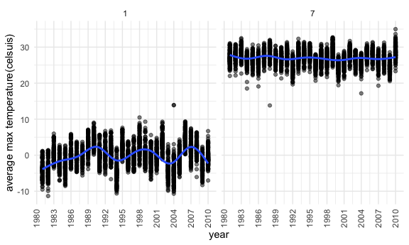
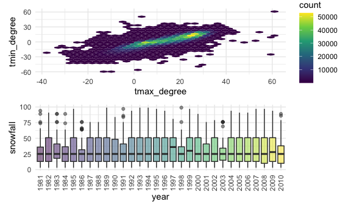

Homework 3 Solution
================
Yiming Zhao

``` r
library(p8105.datasets)
library(tidyverse)
```

    ## ── Attaching packages ─────────────────────────────────────────────────────────────────────────── tidyverse 1.3.0 ──

    ## ✓ ggplot2 3.3.2     ✓ purrr   0.3.4
    ## ✓ tibble  3.0.1     ✓ dplyr   1.0.2
    ## ✓ tidyr   1.1.2     ✓ stringr 1.4.0
    ## ✓ readr   1.3.1     ✓ forcats 0.5.0

    ## ── Conflicts ────────────────────────────────────────────────────────────────────────────── tidyverse_conflicts() ──
    ## x dplyr::filter() masks stats::filter()
    ## x dplyr::lag()    masks stats::lag()

``` r
library(patchwork)
data("instacart")
data("ny_noaa")
```

## Problem 1

The `instacart` dataset contains 1384617 rows and 15 columns.

Observations are the level of items in orders by user. There are
user/order variables – user ID, order day, and order hour, There are
also item variables – name, aisle, department, and some numeric codes.
Here is an example of observations, user 112108 made his/her fourth
order at 10 am to buy 9 products: Bulgarian yogurt, organic 4% milk fat
whole milk cottage cheese and so on.

How many aisles, and which are most items from?

``` r
instacart %>% 
  count(aisle) %>% 
  arrange(desc(n))
```

    ## # A tibble: 134 x 2
    ##    aisle                              n
    ##    <chr>                          <int>
    ##  1 fresh vegetables              150609
    ##  2 fresh fruits                  150473
    ##  3 packaged vegetables fruits     78493
    ##  4 yogurt                         55240
    ##  5 packaged cheese                41699
    ##  6 water seltzer sparkling water  36617
    ##  7 milk                           32644
    ##  8 chips pretzels                 31269
    ##  9 soy lactosefree                26240
    ## 10 bread                          23635
    ## # … with 124 more rows

There are 124 distinct aisles, fresh vegetables aisle is the most items
ordered from.

Make a plot that shows the number of items ordered in each aisle

``` r
instacart %>% 
  count(aisle) %>% 
  filter(n > 10000) %>% 
  mutate(
    aisle = factor(aisle),
    aisle = fct_reorder(aisle, n)
  ) %>% 
  ggplot(aes(x = aisle, y = n)) +
  geom_point() +
  theme(axis.text.x = element_text(angle = 90, vjust = 0.5, hjust = 1))
```


Make a table showing the three most popular items in each of the aisles
“baking ingredients”, “dog food care”, and “packaged vegetables
fruits”.

``` r
instacart %>% 
  filter(aisle %in% c("baking ingredients", "dog food care", "packaged vegetables fruits")) %>% 
  group_by(aisle) %>% 
  count(product_name) %>% 
  mutate(rank = min_rank(desc(n))) %>% 
  filter(rank < 4) %>% 
  arrange(aisle, desc(n)) %>% 
  knitr::kable()
```

| aisle                      | product\_name                                 |    n | rank |
| :------------------------- | :-------------------------------------------- | ---: | ---: |
| baking ingredients         | Light Brown Sugar                             |  499 |    1 |
| baking ingredients         | Pure Baking Soda                              |  387 |    2 |
| baking ingredients         | Cane Sugar                                    |  336 |    3 |
| dog food care              | Snack Sticks Chicken & Rice Recipe Dog Treats |   30 |    1 |
| dog food care              | Organix Chicken & Brown Rice Recipe           |   28 |    2 |
| dog food care              | Small Dog Biscuits                            |   26 |    3 |
| packaged vegetables fruits | Organic Baby Spinach                          | 9784 |    1 |
| packaged vegetables fruits | Organic Raspberries                           | 5546 |    2 |
| packaged vegetables fruits | Organic Blueberries                           | 4966 |    3 |

Apples vs ice cream

``` r
instacart %>% 
  filter(product_name %in% c("Pink Lady Apples", "Coffee Ice Cream")) %>% 
  group_by(product_name, order_dow) %>% 
  summarize(mean_hour = mean(order_hour_of_day)) %>% 
  pivot_wider(
    names_from = order_dow,
    values_from = mean_hour
  )
```

    ## `summarise()` regrouping output by 'product_name' (override with `.groups` argument)

    ## # A tibble: 2 x 8
    ## # Groups:   product_name [2]
    ##   product_name       `0`   `1`   `2`   `3`   `4`   `5`   `6`
    ##   <chr>            <dbl> <dbl> <dbl> <dbl> <dbl> <dbl> <dbl>
    ## 1 Coffee Ice Cream  13.8  14.3  15.4  15.3  15.2  12.3  13.8
    ## 2 Pink Lady Apples  13.4  11.4  11.7  14.2  11.6  12.8  11.9

## Problem 2

Load, tidy, and otherwise wrangle the data.

``` r
acce_df = 
  read_csv("./data/accel_data.csv") %>% 
  pivot_longer(
    activity.1:activity.1440,
    names_to = "minutes_of_day",
    values_to = "activities_count"
  ) %>% 
  mutate(
    minutes_of_day = sub( "activity.", "", minutes_of_day),
    minutes_of_day = as.numeric(minutes_of_day),
    weekend_or_weekday = 
      recode(day,Sunday= "weekend", Saturday = "weekend", Friday = "weekday",
             Monday = "weekday", Tuesday = "weekday", Wednesday = "weekday",
             Thursday = "weekday"),
    day = factor(day, levels= c("Monday", 
    "Tuesday", "Wednesday", "Thursday", "Friday", "Saturday","Sunday"))) %>% 
  arrange(week, day)
```

    ## Parsed with column specification:
    ## cols(
    ##   .default = col_double(),
    ##   day = col_character()
    ## )

    ## See spec(...) for full column specifications.

The result dataset includes the week number, day of week, minutes of
day, activity counts and a weekday vs weekend variables. There are total
50400 observations for recording actvity counts of every minutes in the
35 experiment days.

Traditional analyses

``` r
acce_df %>% 
  group_by(week, day) %>% 
  summarize(sumacti_counts = sum(activities_count)) %>% 
  pivot_wider(
    names_from = day,
    values_from = sumacti_counts
  ) %>% 
  knitr::kable()
```

    ## `summarise()` regrouping output by 'week' (override with `.groups` argument)

| week |    Monday |  Tuesday | Wednesday | Thursday |   Friday | Saturday | Sunday |
| ---: | --------: | -------: | --------: | -------: | -------: | -------: | -----: |
|    1 |  78828.07 | 307094.2 |    340115 | 355923.6 | 480542.6 |   376254 | 631105 |
|    2 | 295431.00 | 423245.0 |    440962 | 474048.0 | 568839.0 |   607175 | 422018 |
|    3 | 685910.00 | 381507.0 |    468869 | 371230.0 | 467420.0 |   382928 | 467052 |
|    4 | 409450.00 | 319568.0 |    434460 | 340291.0 | 154049.0 |     1440 | 260617 |
|    5 | 389080.00 | 367824.0 |    445366 | 549658.0 | 620860.0 |     1440 | 138421 |

From the summary table, we could see that there has the least activity
on Saturdays in week 4 and 5 than any other days in the total 35
experiment days. And also there is less activity in week 4 and week5
weekend than any other weeks. For every week, there is more activities
on Wednesday than Tuesday. The number of activities is relatively stable
on Tuesday and Wednesday.

Make a single-panel plot

``` r
acce_df %>% 
  ggplot(aes(x = minutes_of_day, y = activities_count, color = day)) +
  geom_line() +
  ylab("Activity counts") +
  xlab("Minutes of day(start from midnight") +
  scale_x_continuous(n.breaks = 15)
```


From this plot, we could see that the number of activities spiked at
around 450 minutes of day (nearly 7am). This is the time that people
usually get up, so the number of activities increases. The number of
activities dropped at around 800 minutes of day(nearly 1pm) because
people usually have a break after lunch. And there are more activities
from Friday 1200 minutes(nearly 8pm) to Friday 1300 minutes(nearly
9:40pm) than other week days.

## Problem 3

The `ny_noaa` dataset contains 2595176 rows and 7 columns.

Observations that were reported from different stations are daily
weather data in NY, which including maximum and minimum
temperature(tenth degree of celsius), total daily precipitation(mm),
snowfall(mm), and snow depth(mm). However, observations are not
completed data. Many missing values of maximum and minimum temperature
might obstruct our data analysis.

Do some data cleaning

``` r
ny_noaa_df = 
  ny_noaa %>% 
  separate(date, into = c("year", "month", "day")) %>% 
  mutate(
    month = as.numeric(month),
    year = as.numeric(year),
    tmax = as.numeric(tmax),
    tmin = as.numeric(tmin),
    tmax_degree = tmax / 10,
    tmin_degree = tmin / 10
  ) 

ny_noaa_df %>% 
  group_by(snow) %>% 
  drop_na(snow) %>% 
  count(snow) %>% 
  arrange(desc(n))
```

    ## # A tibble: 281 x 2
    ## # Groups:   snow [281]
    ##     snow       n
    ##    <int>   <int>
    ##  1     0 2008508
    ##  2    25   31022
    ##  3    13   23095
    ##  4    51   18274
    ##  5    76   10173
    ##  6     8    9962
    ##  7     5    9748
    ##  8    38    9197
    ##  9     3    8790
    ## 10   102    6552
    ## # … with 271 more rows

The most commonly observed snowfall value is 0mm. The second commonly
observed snowfall value is 25mm. The third commonly observed snowfall
value is 13mm.

Make a two-panel plot showing the average max temperature in January and
in July in each station across years

``` r
ny_noaa_df %>%
  filter(month == c(1, 7)) %>% 
  group_by(id, year, month) %>% 
  summarize(
    mean_tmax_degree = mean(tmax_degree, na.rm = TRUE)
  ) %>% 
  ggplot(aes(x = year, y = mean_tmax_degree, color = id)) +
  geom_boxplot(alpha = .5, show.legend = FALSE) +
  facet_grid(. ~ month) +
  ylab("average max temperature(celsuis)") +
  scale_x_continuous(
    breaks = c(1980, 1983, 1986,1989, 1992, 1995, 1998, 2001, 2004, 2007, 2010))
```

    ## `summarise()` regrouping output by 'id', 'year' (override with `.groups` argument)

    ## Warning: Removed 5972 rows containing non-finite values (stat_boxplot).



From this two-panel plot,it shows that the average maximum temperature
of January is lower than July. The average maximum temperatures of
January and July across years did not show absolutely increase. It seems
to exist several outliers, which show on boxplot as a dot.

Make a two-panel plot showing (i) tmax vs tmin for the full dataset ;
and (ii) make a plot showing the distribution of snowfall values greater
than 0 and less than 100 separately by year.

``` r
tmax_tmin_p =
  ny_noaa_df %>% 
  ggplot(aes(x = tmax_degree, y = tmin_degree)) +
  geom_hex()+
  theme(legend.text = element_text(angle = 90, vjust = 0.5, hjust = 1)) 

dis_snow_p =
  ny_noaa_df %>% 
  mutate(
    year = as.factor(year)
  ) %>% 
  filter(snow == (1:99)) %>% 
  ggplot(aes(x = year, y = snow, fill = year)) +
  geom_boxplot(alpha = .5, show.legend = FALSE) +
  theme(axis.text.x = element_text(angle = 90, vjust = 0.5, hjust = 1)) +
  ylab("snowfall")
```

    ## Warning in snow == (1:99): longer object length is not a multiple of shorter
    ## object length

``` r
tmax_tmin_p / dis_snow_p
```

    ## Warning: Removed 1136276 rows containing non-finite values (stat_binhex).



It looks like around 29 celsius degree of maxmium temperature with 15
celsius degree of minimum temperature are most commonly observed values.
And year 1986 and year 2003 havr smallest snowfall range.
